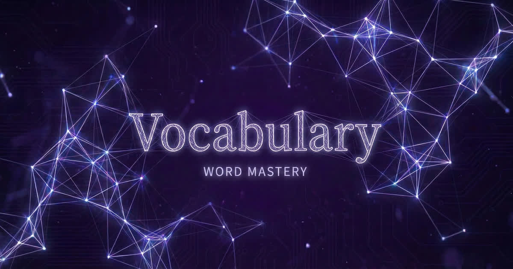

<div align="center">



[](https://www.apache.org/licenses/LICENSE-2.0)
[](https://react.dev/)
[](https://expo.dev/)
[](https://www.typescriptlang.org/)

Master 350 words through interactive quizzes. Track progress, earn achievements, sync across devices.

[Try It](https://vocabulary.hatstack.fun) · [Documentation](./docs/README.md)

---

</div>

## Quick Start

```bash
git clone https://github.com/HatmanStack/react-vocabulary.git
cd react-vocabulary
npm install
npm start
```

Scan QR with Expo Go, or press `a` (Android) / `i` (iOS) / `w` (Web).

## Project Structure

```
react-vocabulary/
├── app/           # Expo Router pages (home, quiz, stats, settings)
├── src/
│   ├── features/  # Vocabulary, quiz, progress, settings modules
│   ├── shared/    # Stores, types, UI components, hooks
│   └── assets/    # Word lists, sounds
├── backend/       # AWS SAM Lambda API
└── docs/          # Full documentation
```

## Commands

```bash
npm start        # Dev server
npm test         # Run tests
npm run check    # Lint + type-check + test
npm run deploy   # Deploy backend (from backend/)
```

## Documentation

- [Full Documentation](./docs/README.md) – Features, architecture, testing
- [Deployment Guide](./docs/DEPLOYMENT.md) – Backend setup, troubleshooting
- [Backend API](./docs/BACKEND-API.md) – API endpoints

## License

[Apache 2.0](LICENSE)
